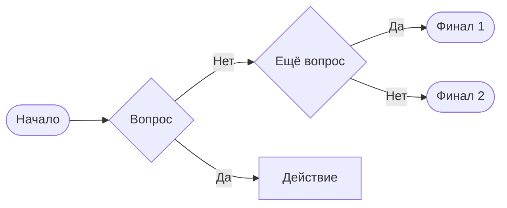

# AutoDoc Features

A reference for the capabilities of the Unic AutoDoc documentation portal (based on Docusaurus). This skill is invoked on demand when a task involves diagrams, OpenAPI, tabs, callouts, static files, or portal configuration.

## Static Files {#static-files}

### Images {#images}

There are two ways to add an image.

**Shared Static repository:**

1. Create a product folder in `static/files/images`, for example `static/files/images/unic`.
1. Add the files to the folder.
1. Insert the image, removing `static` from the path:

   ```markdown
   
   ```

**Your own repository:**

1. Place the file next to the page, for example `./pipelines.png` next to `pipelines.md`.
1. Insert the image:

   ```markdown
   
   ```

### Logo and Favicon {#logo-favicon}

Place `logo.svg` and `favicon.png` in `static/img/`. The logo will appear in the top-left corner, the favicon — in the browser tab.

### Importing Text Files {#text-import}

To reuse the contents of a file in multiple places throughout the documentation:

```jsx
import CodeBlock from '@theme/CodeBlock';
import codeExample from "./user-extension.js?raw"

<CodeBlock language="js">{codeExample}</CodeBlock>
```

The `?raw` suffix tells the bundler to import the file contents as a string.

## Tabs, Callouts, Collapsible Blocks, Code Blocks {#ui-blocks}

These elements are supported out of the box. Use them to structure content: tabs — for parallel variants (different OSes, versions), callouts — for important notes, collapsible blocks — for optional details.

Allowed callout types: `:::info Примечание`, `:::info В разработке`, `:::tip Совет`, `:::caution Важно`, `:::danger Внимание`.

## Diagrams {#diagrams}

Selection order: Mermaid → PlantUML → Kroki → LikeC4 (for interactive C4).

### Mermaid {#mermaid}

Text-based diagrams. The `mdx-mermaid` plugin is enabled; they are also supported in GitLab.

````markdown

````

### PlantUML {#plantuml}

Text-based diagrams rendered to SVG — links and text selection work. Supported in GitLab. The `!include` directive is not supported.

````markdown
```plantuml
Alice -> Bob: Authentication Request
Bob --> Alice: Authentication Response
url of Bob is [[http://www.google.com]]
```
````

External `.puml` files are included via `require`:

```jsx

```

### Kroki {#kroki}

Use this if Mermaid and PlantUML aren't suitable. Supported: BlockDiag, SeqDiag, ActDiag, NwDiag, PacketDiag, RackDiag, BPMN, Bytefield, C4 (with PlantUML), D2, DBML, Diagrams.net, Ditaa, Erd, Excalidraw, GraphViz, Mermaid, Nomnoml, Pikchr, PlantUML, Structurizr, SvgBob, Symbolator, UMLet, Vega, Vega-Lite, WaveDrom, WireViz.

Direct usage:

````markdown
```kroki imgType="excalidraw"
{
  "type": "excalidraw",
  "version": 2,
  ...
}
```
````

Via importing an external file:

1. Create a file `_kroki-excalidraw.mdx`. The `_` prefix hides the file from the documentation tree.
1. Import it on the page:

   ```jsx
   import KrokiExcalidrawExample from './_kroki-excalidraw.mdx'

   <KrokiExcalidrawExample />
   ```

### BPMN {#bpmn}

```jsx
import bpmnDiagramXml from "./user-process.bpmn?raw"

<Bpmn xml={bpmnDiagramXml} />
```

### LikeC4 {#likec4}

Interactive C4 diagrams. Requires the second version of the AutoDoc image.

1. Create a `docs/likec4/` folder and place files with the `.c4` extension there.
1. Insert the component on a page:

   ```jsx
   <LikeC4View viewId="index" />
   ```

Available props:

| Property | Description |
|----------|-------------|
| `viewId` | Typed enumeration of views |
| `interactive` | Whether to open a modal on click, defaults to `true` |
| `where` | Optional filter, as in view predicates |
| `injectFontCss` | Whether to load IBM Plex Sans from a CDN, defaults to `true` |
| `background` | `dots`, `lines`, `cross`, `transparent`, `solid`, defaults to `transparent` |
| `browserBackground` | Same as above, defaults to `dots` |


## Global Search {#global-search}

Nestor Search — cross-cutting search across all AutoDoc documentation. Integration is automatic: indexes are updated on deploy.

## Blog {#blog}

Create a `blog/` folder in the project root. All `.md` and `.mdx` files in it become available at the `/blog/` URL. You can add authors, tags, and dates to posts.

## Global Styles {#custom-styles}

Place an `autodoc-custom.css` file in the project root — AutoDoc will pick it up during the build.
